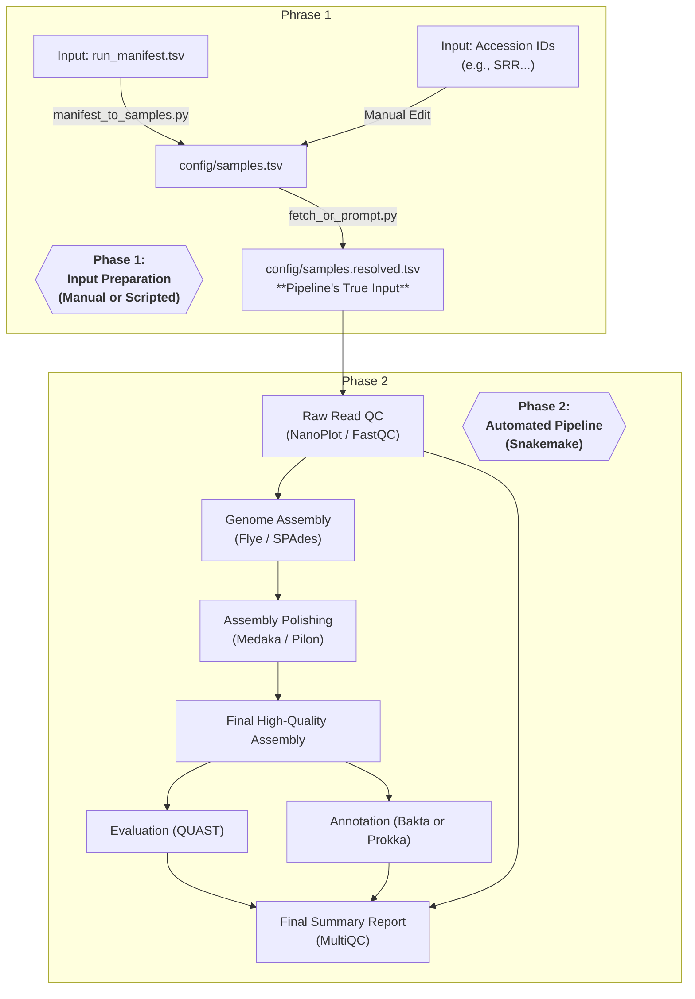

# High-Quality Bacterial Genome Assembly Pipeline

[](https://opensource.org/licenses/MIT)
[](https://snakemake.github.io)

A robust, reproducible, and standards-aware Snakemake pipeline for assembling high-quality bacterial genomes from Oxford Nanopore (ONT) and (optional) Illumina data.

This workflow is designed with best practices for clinical and research environments in mind, emphasizing traceability, quality control, and comprehensive documentation, inspired by GLP and ISO standards.

---

## Features

- **Reproducible**: Uses Conda environments to ensure all tools are version-locked.
- **Scalable**: Easily runs on one sample or hundreds through a simple, two-step input process.
- **Modular**: The workflow is broken into logical, self-contained rule files.
- **Quality-Focused**: Integrates multiple polishing and evaluation steps (Medaka, Pilon, QUAST).
- **Automated Reporting**: Generates a final MultiQC report with key metrics for all samples.
- **Comprehensive Documentation**: Includes a full SOP, validation plans, and QC acceptance criteria.

## Workflow Overview

The pipeline automates all steps from prepared reads to an annotated assembly. The input data flow is designed to be flexible for both wet-lab and dry-lab users.



## Quick Start Guide

### 1. Prerequisites:

- Ensure you have Conda (or preferably Mamba) installed on your system.

### 2. Installation:

- Clone the repository and create the main Snakemake environment.

    ```bash
    # Clone the repository
    git clone https://github.com/yukicyk/nanopore-bac-genome-assembly
    cd nanopore-bac-genome-assembly
    
    # Create the Conda environment for Snakemake
    # This environment is only for running the Snakemake orchestrator
    mamba env create --name bac-wgs-env -f pipeline/envs/snakemake.yaml
    conda activate bac-wgs-env
    ```

### 3. Configuration: 

- Prepare the Sample Sheet
- The pipeline's true input is a single file: `config/samples.resolved.tsv`. 
- You can generate this file using one of two pathways:
   - **Pathway A (For new lab data):**

     1. Fill out a manifest file for your sequencing run and place it in `data/manifests/`. See `docs/run_manifest_README.md` for detailed instructions.
     2. Run the helper scripts to process your manifest and create the final resolved sample sheet:Pathway A (For new lab data):

     ```bash
          # Step 1: Convert your manifest to the primary sample sheet
          python pipeline/scripts/manifest_to_samples.py

          # Step 2: Resolve paths and download data if needed
          python pipeline/scripts/fetch_or_prompt.py --samples config/samples.tsv --out config/samples.resolved.tsv
          
     ```
   - **Pathway B (For public data or manual setup):**

     1. Manually create or edit the file `config/samples.tsv`.
     2. For each sample, provide a `sample_id` and an accession code in the `srrs` or `biosample` column. Leave the `ont_reads`, `illumina_r1` and `illumina_r2` columns blank.
     3. Run the resolver script to download the data and create the final sample sheet:
     
     ```bash
          python pipeline/scripts/fetch_or_prompt.py
     ```
- At the end of either pathway, you will have a valid `config/samples.resolved.tsv` ready for the pipeline.

### 4. Execution

- Run the pipeline. 
- Snakemake will read `config/samples.resolved.tsv` and automatically handle all analysis steps.
   ```bash
   # Perform a dry-run to see what tasks will be executed
   snakemake -n --use-conda -s pipeline/Snakefile

   # Execute the full pipeline on all available cores
   snakemake --cores all --use-conda --reason -s pipeline/Snakefile
   ```
- Upon completion, all results will be in the `results/` directory.

## Directory Structure

```
.
├── config/         # Pipeline configuration and generated sample sheets
├── data/           # Input manifests describing runs and samples
├── docs/           # Project documentation (SOP, QC criteria, etc.)
├── pipeline/       # The Snakemake workflow (Snakefile, rules, envs)
|  └── scripts/        # Helper scripts used by the pipeline.
├── resources/      # The reference data or test dataset
└── results/        # All output files, organized by sample and step


```

## Detailed Documentation

For a complete understanding of the workflow, quality control procedures, and data governance, please refer to the documents in the `docs/` directory:

- **SOP_ONT_bacterial_WGS.md:** The primary Standard Operating Procedure for the entire workflow.
- **run_manifest_README.md:** Detailed guidance on how to fill out the run manifest.
- **QC_Acceptance_Criteria.md:** Specific QC thresholds for accepting or rejecting a result.
- **Validation_and_Verification_Plan.md:** The plan for validating the pipeline's performance.

## Contributing

Contributions are welcome! Please feel free to submit a pull request or open an issue.

## License
This project is licensed under the **MIT License**. See the `LICENSE` file for details.

